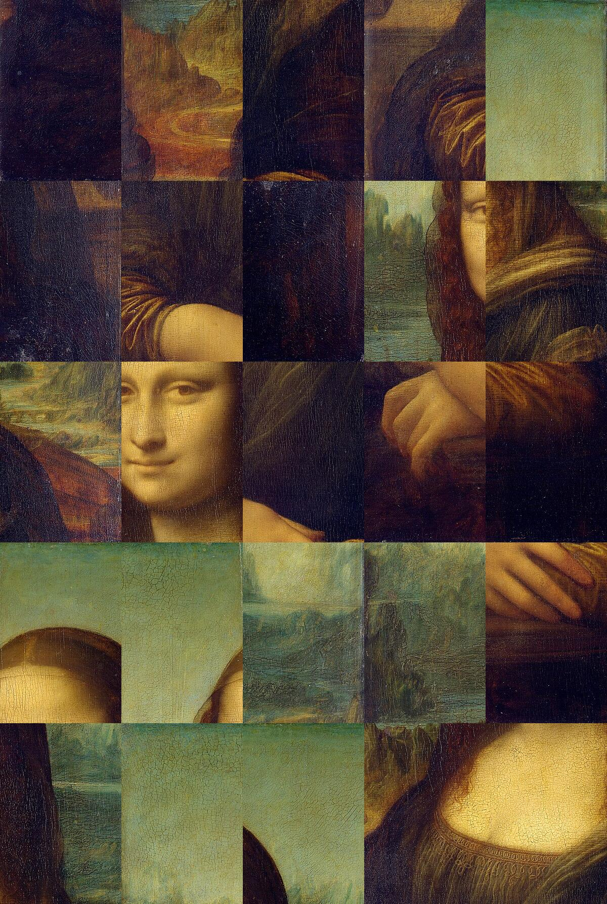
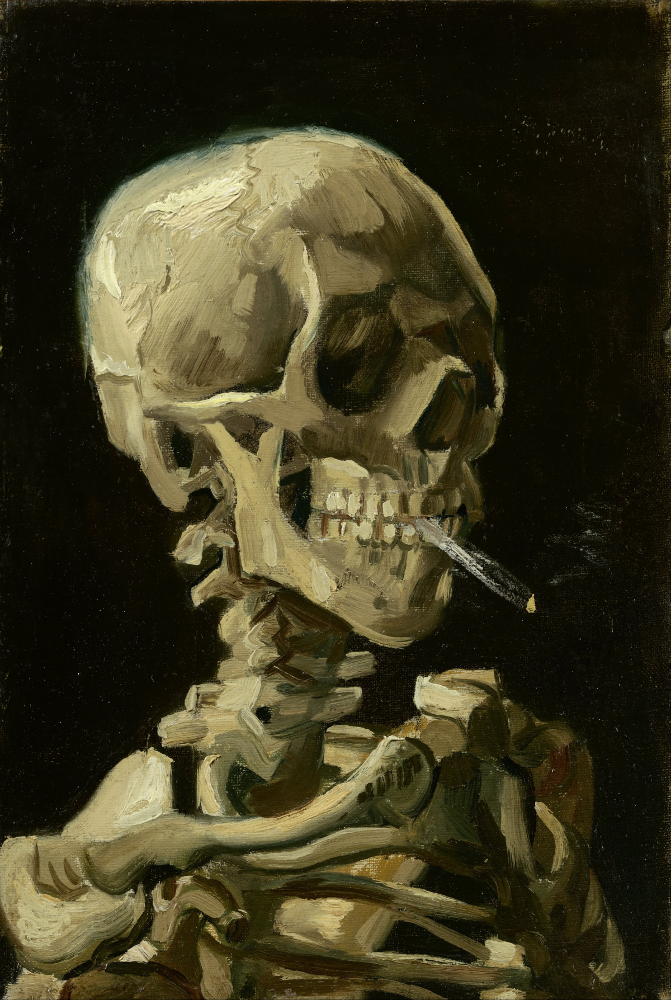
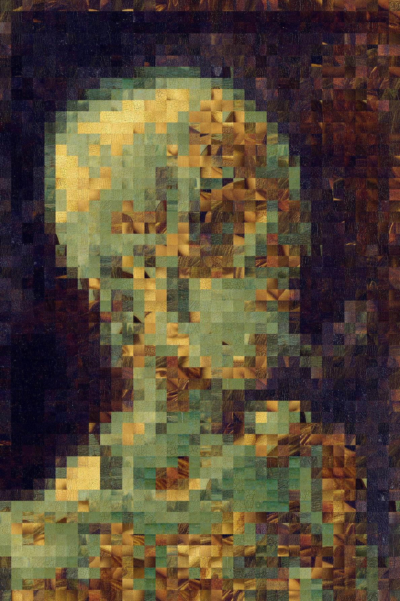
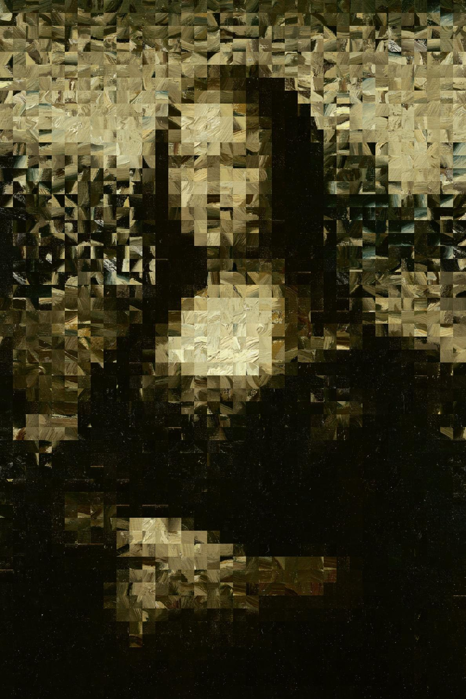

# Image Tiling

By creating custom classes that seperate images into tiles, we can easily 
produce a wide range of interesting results. 

Perhaps most simply, we can cut an image into a 5x5 set of tiles, and then 
shuffle said tiles' locations:

With the implemented tile functionality, such a result comes from a single 
action of shuffling the values.

An example of a more complicated result we can accomplish is the act of 
swapping tiles between two equal sized images to try and create similar results. 
The mapping of tiles between images can be reduced to a matching problem, which 
can thus be solved by the Hungarian algorithm. 

